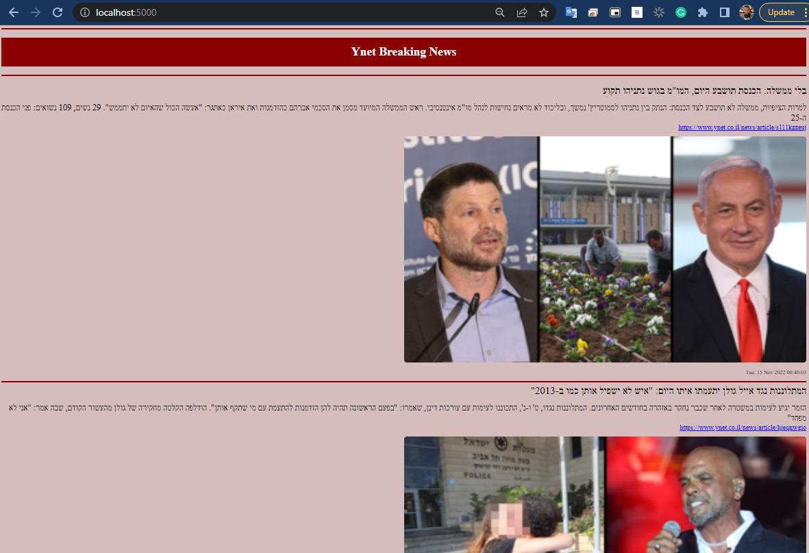
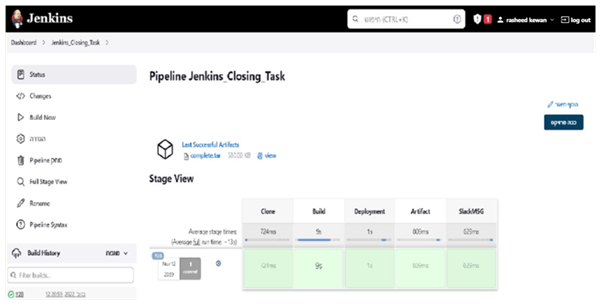
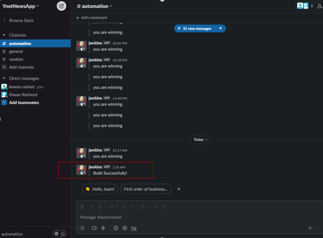

## *About*
> * The app purpose is to read the “Breaking News” from the given URL :- http://www.ynet.co.il/Integration/StoryRss2.xml.
> * Parses and presents the breaking news XML in an HTML Format.
> * The app is built by intellij idea with Java.

## *Run Locally*
### *Clone the project*
```bash
git clone https://github.com/RashedKewan/YnetBreakingNews.git
```
### *Build the project*
```bash
mvn clean package
```
### *Run Jar File*
```bash
run the jar file: java -jar target/YnetBreakingNews-0.0.1-SNAPSHOT.jar
```
##
> ### *Website Home Page*
> 
##
##
> ### *Jenkins Pipeline Job*
> Create a Jenkins CI/CD pipeline Job to Build and Deploy (Run) the application on a new instance.
> 
##
##
> ### *Slack Notification*
> Sent slack notification via jenkins job.
>
> 
